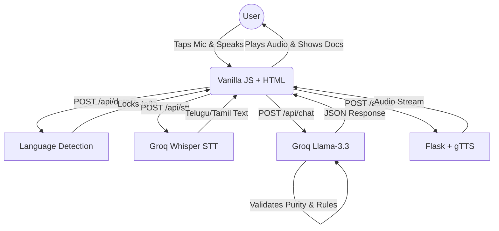

# Sakhi (సఖి / சகி) - Voice-First Widow Pension Assistant

> **A voice-first web application designed for first-time rural women with zero digital literacy, no English knowledge, and no tech background to independently learn about and apply for government widow pension schemes in spoken Telugu or Tamil.**

---

## 🏛️ Chosen Vertical
**Government Welfare / Pension Assistance for Rural Women.**
Sakhi specifically targets the **Andhra Pradesh/Telangana Widow Pension** and the **Tamil Nadu Destitute Widow Pension**. This vertical was chosen because the target demographic—rural widows—often lacks digital literacy, cannot read English, and is highly vulnerable to exploitation by middlemen who charge fees to fill out free government forms.

## 🧠 Approach and Logic
The goal is to create an interface with **zero cognitive load**. 
- **No forms, no menus, no English, no login.** 
- **Voice-first**: A single large button is the only interaction point.
- **Auto-Detection**: The user speaks a natural greeting ("నమస్కారం" or "வணக்கம்"). Sakhi detects the language and locks the session, automatically loading the correct regional scheme context and UI language.
- **Script Purity**: Strict Unicode boundary checks ensure the AI never hallucinates English words or mixes scripts.
- **Accessibility & Empathy**: Responses are strictly limited to two short sentences, spoken respectfully (using "அம்மா" / "అమ్మా"), with visual indicators for required documents once eligibility is determined.

## ⚙️ How It Works



1. **Frontend (`static/app.js`)**: Captures audio, checks for silence, and sends chunks to the Flask backend. Handles UI state via CSS classes.
2. **Backend (`backend/`)**: Serves as a secure orchestrator. It manages Groq API keys (with automatic failover rotation), handles rate limiting, and performs purity checks.
3. **Groq API**: Provides near-instant Speech-to-Text and LLM reasoning.
4. **TTS**: `gTTS` generates audio on the fly (with in-memory caching for static strings) and streams it back to the user.

## 📝 Assumptions
1. **Hardware**: The user has access to a smartphone or computer with a working microphone.
2. **Connectivity**: The user has an active internet connection (3G/4G).
3. **API Keys**: Groq API keys are provided and have sufficient quota.
4. **Environment**: The user is in a relatively quiet environment for STT to accurately capture spoken words (though dynamic ambient noise calibration is implemented).

## 🚀 Setup

### 1. Install Dependencies
```bash
python -m venv venv
source venv/bin/activate  # On Windows: venv\Scripts\activate
pip install -r requirements.txt
```

### 2. Configure Environment
Create a `.env` file in the root directory:
```env
# Single key or comma-separated list of Groq API keys for automatic rotation
GROQ_API_KEYS=gsk_your_key_1,gsk_your_key_2
FLASK_DEBUG=1
```

### 3. Run the Server
```bash
python app.py
```
Open `http://localhost:5000` in your browser.

## 🧪 Testing
The project includes a robust `pytest` suite with `unittest.mock` covering language detection, API fallbacks, input validation, and endpoints.

To run the tests with coverage:
```bash
export PYTHONPATH="." # On Windows PowerShell: $env:PYTHONPATH="."
pytest --cov=backend --cov-report=term-missing
```
**Current Coverage**: 90%

## 🔒 Security Notes
- **Thread-safe Key Rotation**: Groq API keys are stored server-side and rotated safely using a `threading.Lock()` to prevent race conditions during rate-limit recovery.
- **Input Validation**: Audio file sizes are clamped (500B to 5MB). Chat payloads are limited in length (max 1000 chars) to prevent prompt injection and DoS.
- **Rate Limiting**: `Flask-Limiter` restricts API calls (e.g., 20/min for detection) to prevent abuse.
- **Security Headers**: Endpoints attach CSP, X-Content-Type-Options, and Referrer-Policy headers.
- **XSS Prevention**: The frontend strictly uses `textContent` instead of `innerHTML` for displaying user and LLM-generated text.
- **Stateless & Local**: No databases are used; conversation history is held ephemerally in the frontend JS memory.
